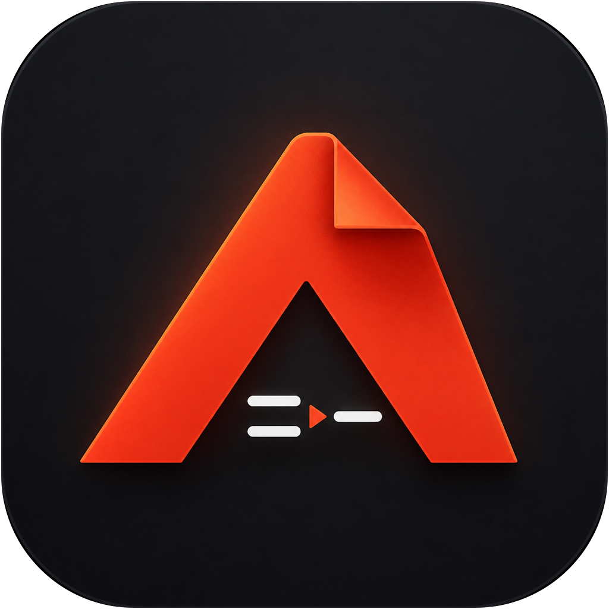

<p align="center">
  
</p>

<h1 align="center">Markshift</h1>

<p align="center">
  <strong>Documents to Markdown, privately on-device.</strong>
</p>

<p align="center">
  A clean SwiftUI app for macOS, iPhone and iPad that converts documents into readable, conversation-ready Markdown without uploading files to a server.
</p>

## About

Markshift turns individual documents or mixed-format batches into clean Markdown. Conversion happens locally on the device, making it suitable for private documents, research material, presentations, spreadsheets, notes and AI-ready text preparation.

## Highlights

- Private, on-device document conversion
- Single-file `.md` saving
- Mixed-format batch processing with live progress
- Batch ZIP export with individual Markdown files
- Combined `All Documents - Conversation Ready.md` output
- Detailed batch conversion report
- Drag-and-drop and multiple-file selection
- Rendered preview and raw Markdown views
- Copy Markdown directly to the clipboard
- Retry, cancellation and conversion notes
- Universal Mac build for Apple Silicon and Intel

## Supported inputs

| Category | Formats and handling |
| --- | --- |
| PDF | Text extraction and on-device Vision OCR for scanned pages |
| Word | `.docx`, `.docm` paragraphs, headings, lists and tables |
| PowerPoint | `.pptx`, `.pptm` slide text and tables |
| Excel | `.xlsx`, `.xlsm` worksheets and saved formula values |
| OpenDocument | `.odt`, `.odp`, `.ods` |
| E-books | EPUB readable content |
| Images | On-device OCR for supported image formats |
| Text and data | Markdown, TXT, CSV, TSV, JSON, XML, YAML, HTML and RTF |
| Other readable files | Best-effort detection for logs, source files and mislabeled Office archives |

## Privacy

Markshift processes documents locally. Files and extracted content are not uploaded by the app.

The app uses Apple's system frameworks for PDF processing, text recognition and interface rendering. ZIPFoundation is used to read modern Office and OpenDocument containers and to create batch archives.

## Download and install

Download the latest Mac DMG from [GitHub Releases](../../releases/latest).

1. Open `Markshift-1.0.1-macOS.dmg`.
2. Drag **Markshift** into **Applications**.
3. Open Markshift from the Applications folder.

The current community build is locally signed but not Apple-notarized. If macOS blocks the first launch, open **System Settings → Privacy & Security**, find the Markshift notice and select **Open Anyway**. Only do this when the DMG came from this official repository or another source you trust.

### Requirements

- macOS 15 or newer
- Apple Silicon or Intel Mac
- Xcode is not required to install or use the DMG

## Build from source

1. Download or clone this repository.
2. Open `Markshift.xcodeproj` in Xcode 26.6 or newer.
3. Allow Xcode to resolve the ZIPFoundation Swift package.
4. Select the **Markshift** scheme.
5. Choose **My Mac**, an iPhone/iPad Simulator or a connected device.
6. Press **Run** (`⌘R`).

A free Personal Team is sufficient for development and testing on your own devices. Public Developer ID distribution and notarization require Apple Developer Program membership.

The default bundle identifier is `com.kamal.Markshift`. Change it under **Signing & Capabilities** if needed.

## Batch output

A saved batch ZIP contains:

```text
markdown/
  Document 1.md
  Document 2.md
All Documents - Conversation Ready.md
Conversion Report.md
```

## Format limitations

Markdown cannot reproduce every part of a visually complex document.

- Old binary Office formats (`.doc`, `.ppt`, `.xls`) should first be saved as `.docx`, `.pptx` or `.xlsx`.
- Slide positioning, charts, transitions and animations become reading-order text or conversion notes.
- Images and embedded Office objects are reported but are not exported as separate assets.
- Excel formulas use the last value saved in the workbook; formulas are not recalculated.
- OCR output should be reviewed for names, numbers and complex tables.
- Password-protected files must be unlocked before conversion.

## Verification

Markshift 1.0.1 (build 2) has been verified with:

- Release builds for Apple Silicon and Intel Macs
- Generic iPhone and iPad Simulator builds
- Nine conversion and batch-export tests
- DMG and source-archive integrity checks

## Dependency

- [ZIPFoundation](https://github.com/weichsel/ZIPFoundation) 0.9.20 — MIT License

## Credits

Conceptualized, ideated and designed by **CRIT Studio**  
Created by **Kamalanarayanan**  
Contact: [kamalgeek92@gmail.com](mailto:kamalgeek92@gmail.com)

## Copyright

Copyright © 2026 Kamalanarayanan, CRIT Studio. All rights reserved.

See [COPYRIGHT.md](COPYRIGHT.md) for the complete copyright and brand notice.
