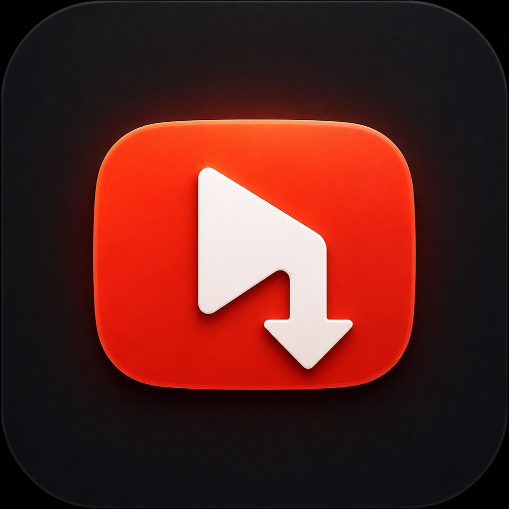

<p align="center">
  
</p>

<h1 align="center">YTGrab</h1>

<p align="center">
  A native macOS utility for downloading YouTube videos as edit-ready MP4 files.
</p>

<p align="center">
  
  
  
  
</p>

YTGrab downloads a video, prepares a Premiere-friendly MP4, and uses Apple's VideoToolbox media engine for fast hardware-accelerated encoding on M-series Macs. `yt-dlp`, Deno, FFmpeg, and FFprobe are included, so no Homebrew packages, plugins, or helper installations are required.

## Highlights

- Native SwiftUI interface for macOS.
- Detects a video's available resolution, codec, frame rate, HDR status, and duration before download.
- Offers only the quality levels that are actually available for the selected video.
- Supports hardware-accelerated encoding with VideoToolbox, plus software encoding when preferred.
- Produces MP4 files designed to work cleanly with QuickTime and Adobe Premiere Pro.
- Preserves source colour metadata to avoid unexpected colour shifts.
- Converts incompatible Opus audio to AAC while copying compatible AAC and MP3 audio when possible.
- Keeps temporary files beside the chosen output and cleans them up after completion, cancellation, or an error.
- Includes in-app updates for `yt-dlp` and Deno with checksum and launch validation.

## Requirements

- macOS 14 Sonoma or newer
- Apple Silicon Mac

## Install

1. Download `YTGrab-1.2-Apple-Silicon.dmg` from the [latest release](../../releases/latest).
2. Open the DMG.
3. Drag **YTGrab** into **Applications**.
4. Open YTGrab from the Applications folder.

> [!NOTE]
> The current local build is signed for local use and is not notarized for public distribution. If macOS shows a security warning, Control-click YTGrab, choose **Open**, and confirm once.

## Use

1. Paste a YouTube link.
2. Select **Check** to inspect the available formats.
3. Choose the quality and encoding option you want.
4. Select an output location and start the download.

For 4K output, the **Archive** or **High** preset with the media engine is recommended. YouTube generally provides video above 1080p as VP9 or AV1, so 4K output usually requires transcoding instead of a direct H.264 copy.

If a download stops working, use **YTGrab → Check for Tool Updates…**. YouTube changes frequently, and an outdated `yt-dlp` build is a common cause.

## What's new in 1.2

- A compact, centered 720 × 540 main window.
- A shorter, cleaner layout.
- An activity log that appears only while it is useful.
- A dedicated play-and-download YTGrab app icon.
- A compact About panel containing the CRIT Studio mark.
- Embedded `yt-dlp`, Deno, FFmpeg, and FFprobe tools.
- In-app updates for `yt-dlp` and Deno.

## Build from source

Open the Xcode project:

```bash
open Source/YTGrab-Xcode/YTGrab.xcodeproj
```

Press **Run** in Xcode. The embedded tools are already part of the project, so there are no packages to install or dependencies to resolve.

The project uses ad-hoc signing by default (`CODE_SIGN_IDENTITY = "-"`), which allows local builds without an Apple Developer account. For public distribution, configure your own Developer ID signing and notarization workflow, then re-test the signing of bundled child processes.

## Embedded tools

YTGrab stores managed copies of its tools in the app's private Application Support directory. The updater retrieves official releases of `yt-dlp` and Deno, verifies the published SHA-256 digest, validates each executable, and replaces the managed copy only after validation succeeds.

FFmpeg and FFprobe remain pinned to the versions tested with each YTGrab release so encoding behaviour does not change unexpectedly.

## Third-party licenses

The app includes third-party components under their respective licenses:

- [yt-dlp](https://github.com/yt-dlp/yt-dlp) — The Unlicense
- [Deno](https://github.com/denoland/deno) — MIT License
- [FFmpeg](https://ffmpeg.org/) and FFprobe — GNU GPL v3 or later for the bundled build

License notices, the exact FFmpeg build configuration, the GPL text, and relevant upstream source information are included in `Source/YTGrab-Xcode/YTGrab/Licenses` and are also available through **Help → Embedded Tools & Licenses** in the app.

## Responsible use

Download only content you own or have permission to save. You are responsible for following applicable laws, copyright rules, and the terms of service of the websites you use.

## Copyright

Copyright © 2026 Kamalanarayanan, CRIT Studio. All rights reserved.
